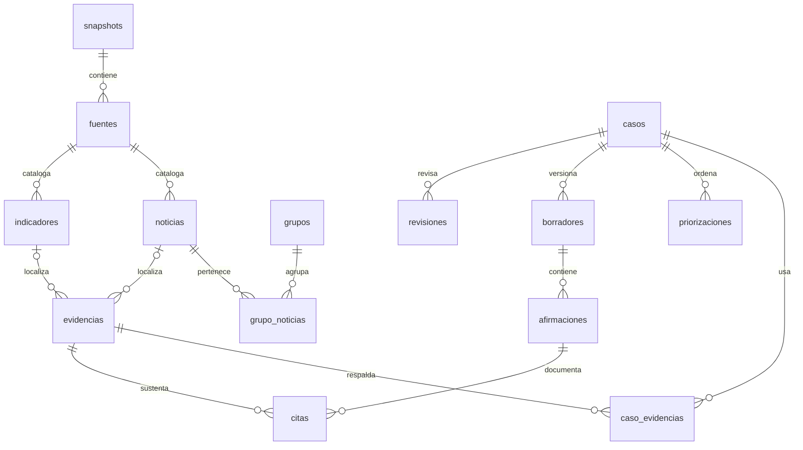

# Modelo de datos v1: de fuente a revisión
Estado: esquema SQLite y validador de ejemplos sintéticos ejecutables. No es la aplicación editorial, el importador oficial ni la IA.

## Decisión de implementación
SQLite es una referencia local sin servidor. Python usa solo biblioteca estándar para ejecutar/verificar el contrato. No fija framework web, proveedor IA o almacenamiento definitivo. No se tocó Notion ni se asignaron tareas.

## Relaciones


Cada evidencia apunta exactamente a una noticia o un indicador. Las claves incluyen snapshot_id para impedir relaciones entre conjuntos. Las citas exigen evidencia asociada al mismo caso que la afirmación.

## Cómo probar
Requisitos: Python 3.10+ y SQLite 3.37+. Comprobar la versión de SQLite si se usa un entorno antiguo. Sin paquetes pip.

Desde la raíz:
```sh
python scripts/modelo_datos.py
python -m unittest discover -s tests -p "test_*.py" -v
python scripts/modelo_datos.py --output data/local/modelo-demo.sqlite
```
En Windows puede usarse py -3 en lugar de python.
El primero valida en memoria; el tercero crea una base NUEVA, nunca sobrescribe.
Las bases locales no se suben a GitHub. Cada conexión futura debe activar PRAGMA foreign_keys=ON.

## Ejemplo
El fixture tiene una cifra INVENTADA de 7,25 para PAN/2023 y null para 2024:
registro → evidencia campo valor → caso → borrador → afirmación → cita → revisión ficticia.
No presentarla como cifra del Banco Mundial. País, año y unidad se consultan en el registro completo.
Tres publicaciones de un grupo muestran una procedencia identificada y una publicación de origen desconocido; no son tres corroboraciones.
La contradicción conserva ambas evidencias sin elegir cuál es verdadera.
Un caso sin datos conserva su pregunta pendiente, sin fabricar respuesta.

## Comprobaciones
- Tipos, claves, referencias y separación de snapshots.
- Nulos preservados, coordenada de indicador única.
- Fechas UTC válidas; publicación y detección no posteriores a extracción.
- Evidencia sobre campo permitido y valor no nulo.
- Cada afirmación factual declarada tiene cita de sustento y aparece en su sección del borrador.
- Brief/copy dentro de límites, tres preguntas.
- Puntaje coherente con componentes/pesos cuando existe una priorización.
- Estados sin publicado; aprobación apunta a un borrador.
- Historial de revisión inmutable y secuencia consecutiva.

## Límites explícitos
Una cita válida estructuralmente no demuestra sustento semántico. Hace falta revisión humana.
No detecta afirmaciones factuales que el generador omita de la colección de afirmaciones.
No mide duración de guion ni implementa flujo completo de aprobación.
No importa CSV por filas ni calcula manifest/hashes de un snapshot real.
No exporta fichas.jsonl, no implementa NLP, UI, abstención generativa ni detección automática de contradicciones.
El loader rechaza el fixture completo si falla; T01 requerirá un importador que separe filas inválidas sin bloquear toda la carga.
Las tablas de datos/borradores no son un sistema de auditoría inmutable completo: el servicio futuro debe controlar cambios/versiones.
Las pruebas del contrato no equivalen a T01–T10 del reto.
El snapshot real y su filtro temporal siguen pendientes de la organización.

## Posibles aportes posteriores, sin asignación
Importador CSV con cuarentena; exportador fichas; migraciones; revisión de contratos; UI lectora; evaluación semántica de citas.

