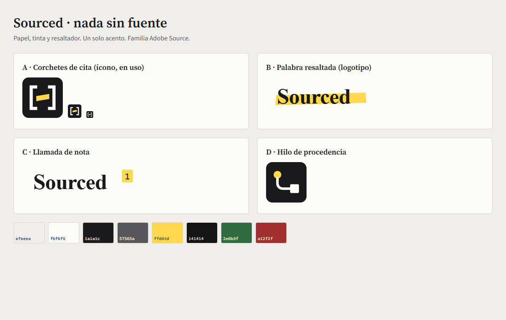
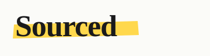
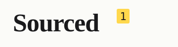

# Marca Sourced — dirección y conceptos de logo

**Sourced · nada sin fuente.** Un copiloto editorial que no afirma nada sin señalar de dónde sale.

## Idea central: los materiales de la verificación
La marca sale del producto, no de una moda. En una redacción, verificar es **papel, tinta y resaltador**: se lee el original, se subraya lo que lo sostiene y se anota la fuente al margen. En Sourced cada cita ya aparece resaltada en amarillo; ese resaltador es la marca.

Por qué no otra cosa: los degradados morado/azul, el crema con terracota y el negro con verde ácido se volvieron la «firma» de las interfaces generadas por IA ([Capital & Compute](https://capitalandcompute.net/blog/fix-ai-slop-design/), [Design Systems Collective](https://www.designsystemscollective.com/you-can-tell-its-ai-yes-that-s-the-compliment-8e9a0392434a), [DEV](https://dev.to/jaainil/ai-purple-problem-make-your-ui-unmistakable-3ono)). La referencia editorial clásica —titulares en serif, filetes finos en vez de cajas, tinta sobre papel— viene de los diarios y de herramientas de lectura sobrias, y encaja con una redacción que pasa horas frente a la pantalla.

## Paleta (un solo acento)
| Uso | Redacción (claro) | Sala (oscuro) |
|---|---|---|
| Fondo (papel de prensa / grafito) | `#efeeea` | `#141414` |
| Superficie | `#fbfbf8` | `#1d1d1b` |
| Tinta (texto y botones) | `#1a1a1c` | `#edebe4` |
| Secundario | `#57565a` | `#b4b1a8` |
| Filete | `#d6d4cd` | `#34332f` |
| **Resaltador (único acento: citas, marca, foco en Sala)** | `#ffd84d` / cita `#ffe27a` | `#ffd84d` |
| Estados (evidencia) | suficiente `#2e6b3f` · parcial `#8a5410` · insuficiente `#a12f2f` | `#86cf9e` · `#e9b45c` · `#ff9a8f` |

Todos los pares de texto pasan WCAG AA (`python scripts/check_contraste.py`). Nada de degradados, brillos ni sombras de colores.

## Tipografía: la familia Adobe «Source»
Coherente con el nombre y libre (SIL OFL 1.1), servida en local:
- **Source Serif 4** (600) — logotipo, titulares de casos y paneles.
- **Source Sans 3** (400/600/700) — interfaz y controles.
- **Source Code Pro** (400/500) — puntajes, IDs, etiquetas de cita.

## Conceptos de logo (para que Diego construya la versión final)

### A · Corchetes de cita *(en uso en la app como ícono y favicon)*

Los corchetes `[ ]` son el signo con el que el periodismo marca lo citado o lo añadido; dentro, una franja de resaltador. Funciona a 16 px, en un solo color y en los dos temas (en Sala el cuadro se invierte). Variante para explorar: corchetes más finos y la franja ligeramente torcida, como trazo a mano.

### B · Palabra resaltada

El logotipo «Sourced» en serif con una pasada de resaltador detrás de «Source», sin cubrir la «d»: la fuente queda marcada. Bueno para portada, pitch y redes. Explorar la pasada con borde irregular (escaneada de un resaltador real) para que no parezca un rectángulo digital.

### C · Llamada de nota

«Sourced¹»: el superíndice de nota al pie, la promesa de que todo remite a su fuente. El «¹» resaltado puede vivir solo como avatar o sello («verificado por Sourced¹»).

### D · Hilo de procedencia

Un punto (la fuente) unido por una línea a un bloque (la afirmación). Explica el producto en un gesto; más abstracto, menos reconocible a primera vista que A.

**Recomendación:** A como ícono de la app y favicon, B como logotipo horizontal. Comparten resaltador y serif, así que funcionan juntos.

## Voz
Español sobrio, frases cortas, verbos concretos. Sin «potencia», «revoluciona», signos de exclamación ni promesas de verdad: Sourced **señala** de dónde sale algo y **dice** cuando no lo sabe.

## Aplicaciones rápidas
- **Pitch / Notion:** portada en papel `#efeeea`, logotipo B, una captura real con una cita resaltada.
- **Redes:** tarjeta con un titular real y su cita resaltada; pie «Sourced · nada sin fuente».
- **Sello:** «¹» resaltado en la esquina de piezas que pasaron por Sourced.
