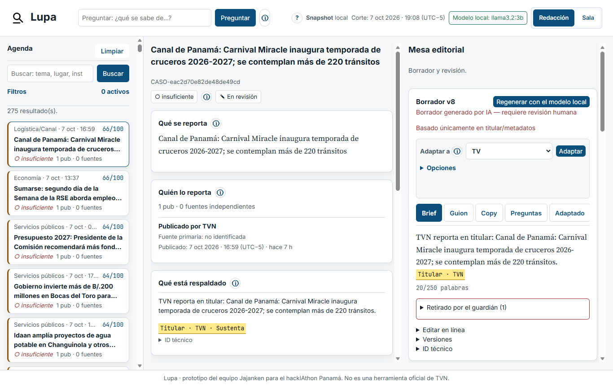
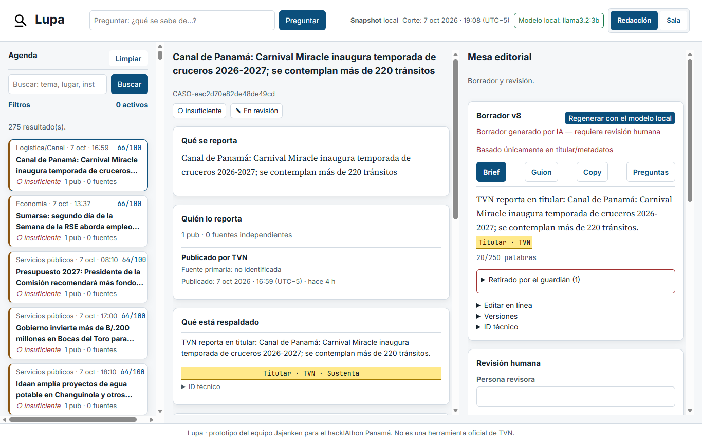
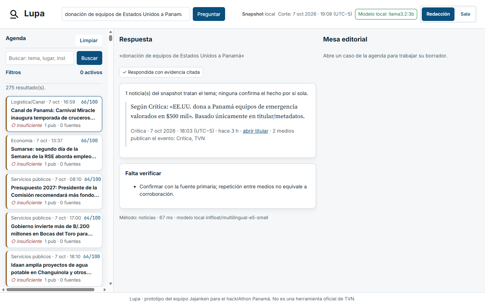
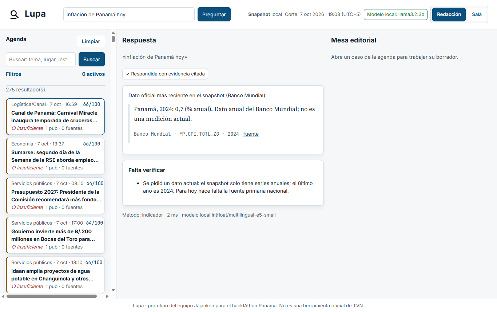
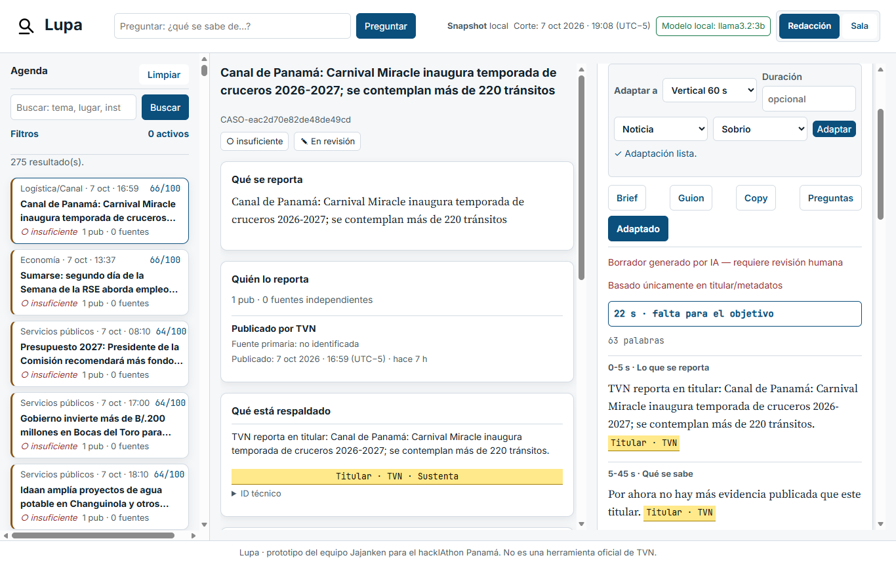
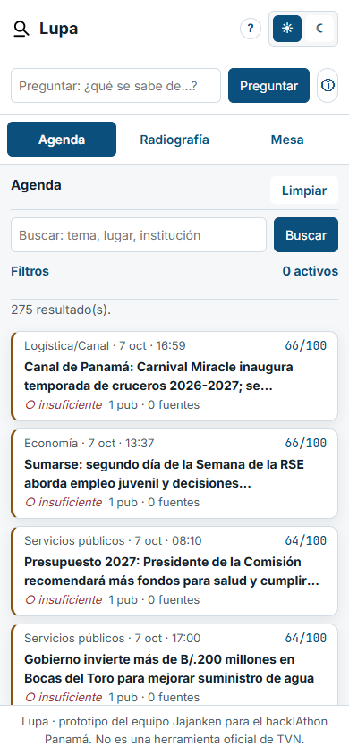
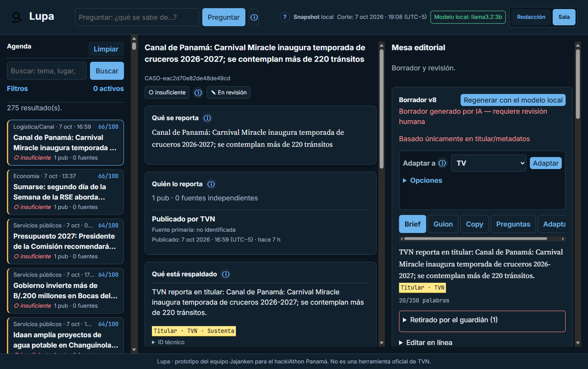

# Jajanken Lupa — Dossier del reto TVN Media

> **Antes de contar una historia, mostramos qué la sostiene.** Prototipo del equipo Jajanken para el hackIAthon Panamá 4ª edición, reto «De la señal a la decisión». No es una herramienta oficial de TVN.

**Equipo:** Josué Carrillo · Diego Laverde · Juan Andrés «Juanchi» López
**Modalidad:** editorial (con consulta de entorno logístico, CU-05)
**Repositorio:** https://github.com/pixeltabletop/jajanken-lupa (rama de entrega: ver README)
**Demo:** local, sin internet ni GPU (instrucciones en el README)
**Notion:** la organización indicó avanzar sin depender de Notion (la cuenta Business del reto no funciona); este documento es la fuente completa y hay una copia en el espacio «hackIAthon 4taEd».

*Agenda con puntaje y evidencia por separado (izquierda), radiografía del caso (centro) y mesa editorial con borrador citado, adaptación de formato y lo que retiró el guardián (derecha).*

---

## 1. Inicio del reto

### Problema
Una redacción revisa fuentes dispersas, elimina duplicados y prepara piezas con prisa. Que una noticia circule no significa que esté confirmada: varios medios pueden repetir una misma fuente.

### Usuario
Editor/a, periodista, productor/a digital, director/a de noticias y presentador/a.

### Qué hace Lupa
1. **Agenda priorizada** con el porqué de cada tema (puntaje desglosado) y su estado de evidencia, por separado.
2. **Radiografía** de cada tema: qué se reporta, quién lo reporta, qué está respaldado, qué falta verificar.
3. **Mesa editorial**: brief, guion cronometrado, copy y preguntas de investigación, con una cita por afirmación.
4. **Preguntas en español** con respuesta citada o abstención explícita.
5. **Adaptar la nota** a TV, radio 30 s, video vertical 60 s, web o alerta, sin añadir datos: mismas citas, otro orden y extensión.
6. **Revisión humana** con historial: nada se publica automáticamente.

### Alcance
Incluye CU-01 a CU-05 sobre un snapshot público reproducible. No incluye: rating o audiencia, detección de «noticias falsas», datos personales, producción audiovisual ni publicación automática.

### Criterios de éxito
Cobertura de citas 100 % · abstención correcta ≥ 80 % · ninguna cifra inventada · demo sin internet · latencia mediana ≤ 15 s.

---

## 2. Plan y decisiones

### Plan (tareas)
| # | Tarea | Responsable | Estado |
|---|---|---|---|
| 1 | Analizar bases del reto y repo de partida | Josué | Hecho |
| 2 | Blueprint de arquitectura y diseño | Josué | Hecho |
| 3 | Snapshot reproducible (5 RSS, Banco Mundial, USGS) | Josué + Codex | Hecho |
| 4 | Sistema visual (temas Redacción y Sala, accesibilidad) | Josué + Codex | Hecho |
| 5 | Capa de IA local (embeddings, agrupación, búsqueda) | Josué + Codex | Hecho |
| 6 | Redacción con guardián y mesa editorial | Josué + Codex | Hecho |
| 7 | Preguntas con abstención (CU-02, CU-04, CU-05) | Josué | Hecho |
| 8 | Benchmark de desarrollo y matriz T01–T10 | Josué | Hecho |
| 9 | Etiquetado humano de temas y pares (pre-etiquetado por Codex, revisado por persona) | Josué, Diego, Juanchi | En curso |
| 10 | Formatos de adaptación (TV, radio, vertical, web, alerta) | Josué + Codex | Hecho |
| 10b | Guías «qué significa» y guía rápida en la interfaz | Josué + Codex | Hecho |
| 11 | Prueba sin internet (T10) | Josué | Hecho |
| 12 | Integración, pitch y entrega | Diego, Juanchi, Josué | Pendiente |

### Decisiones justificadas
| ID | Decisión | Por qué | Alternativa descartada |
|---|---|---|---|
| R2-002 | Embeddings locales para clasificar, agrupar y buscar; el modelo de lenguaje solo redacta; guardián determinista | IA sustantiva medible, funciona sin internet, cada afirmación queda citada | Todo con un modelo de lenguaje (puntaje no reproducible, se cae sin red) |
| R2-004 | Redacción con Ollama local (`llama3.2:3b`), sin API de pago | Costo cero por uso; un tercero lo instala sin claves | API en la nube (costo y dependencia de red) |
| R2-005 | `llama3.2:3b` elegido por banco de 5 modelos | El más fiel: no inventó cifras ni datos; los otros inventaron detalles, imágenes o citaron una fuente maliciosa | qwen3:4b (mejor prosa, inventó «maíz y frutas tropicales») |
| R2-006 | Azul propio afín al ecosistema de TVN, tema oscuro «Sala» | Que no desentone con el cliente sin copiar su marca | Paleta verde/lima original |
| — | GDELT fuera; RSS de 5 medios panameños | GDELT respondió HTTP 429 a todas las consultas; varios medios permiten distinguir repetición de corroboración | Esperar a GDELT |

---

## 3. Catálogo de datos

| Fuente | URL | Extracción | Cobertura | Campos | Condiciones | Transformaciones |
|---|---|---|---|---|---|---|
| TVN (RSS) | https://www.tvn-2.com/rss/ | 2026-10-07/08 (2 capturas) | ~1 día por captura | título, URL, fecha de publicación | Solo titular y metadatos; sin descripción ni imágenes | URL normalizada, ID estable SHA-256 |
| La Prensa (RSS) | https://www.prensa.com/arc/outboundfeeds/rss/ | 2026-10-08 | Notas de ago–oct 2026 | Igual | Igual | Igual |
| Crítica (RSS) | https://www.critica.com.pa/rss.xml | 2026-10-08 | Incluye una nota de abr 2025 (recirculada) | Igual | Igual | Igual |
| Panamá América (RSS) | https://www.panamaamerica.com.pa/rss.xml | 2026-10-08 | Notas de feb 2024 | Igual | Igual | Igual |
| En Segundos (RSS) | https://ensegundos.com.pa/feed/ | 2026-10-08 | oct 2026 | Igual | Igual | Igual |
| Banco Mundial API v2 | https://api.worldbank.org/v2/ | 2026-10-08 | PAN, CRI, COL, DOM, MEX, GTM · 2010–2024 · 6 indicadores | país, indicador, año, valor, unidad | CC BY 4.0 (verificar excepciones) | Cuadrícula de 540 combinaciones; nulos nunca como 0 |
| USGS sismos | https://earthquake.usgs.gov/fdsnws/event/1/ | 2026-10-08 | 2024, lat 5–12, lon −86 a −76, M ≥ 3 | id, magnitud, fecha, lugar, coordenadas, URL | Dominio público | Solo hechos sísmicos |

**Snapshot `real-20261007b`:** 284 titulares, 540 valores, 82 sismos. Hash SHA-256 por archivo en `data/snapshot-dev/real-20261007b/processed/manifest.json`.
> El documento del reto calcula 1.350 combinaciones del Banco Mundial; 6 países × 6 indicadores × 15 años dan 540. Usamos 540 y no se inventan filas.

---

## 4. Diseño de solución

**Flujo:** snapshot → validación con cuarentena → embeddings locales → tema y grupos → relación con indicadores → ranking explicable → ficha → borrador citado → guardián → revisión humana.

| Pieza | Tecnología | Versión / parámetros |
|---|---|---|
| Embeddings | `intfloat/multilingual-e5-small` (CPU) | dim 384; agrupación por enlace promedio, umbral 0,945 calibrado con datos reales |
| Búsqueda y abstención | Semántica + coincidencia de contenido | responde si similitud ≥ 0,88, o ≥ 0,84 con una palabra de contenido común; si no, se abstiene |
| Redacción | Ollama `llama3.2:3b` | temperatura 0,2; salida JSON forzada; costo 0 por uso; 60–90 s por borrador en CPU |
| Guardián | Reglas deterministas | retira afirmaciones sin cita, cifras y términos sin respaldo, imágenes o citas inventadas, tono publicitario e instrucciones de fuentes |
| Ranking | P = 30R + 25I + 20U + 15N + 10E | componentes visibles con su criterio; versión de reglas registrada |
| Interfaz | Servidor local de biblioteca estándar + HTML/CSS/JS | solo 127.0.0.1; fuentes locales; WCAG 2.2 AA medido |

**Reparto de responsabilidades:** el código decide qué afirmaciones existen, su cita, el puntaje, el estado de evidencia y la publicación (que no existe). El modelo solo redacta, y el guardián decide qué se acepta.

---

## 5. Casos y evidencias

Snapshot `real-20261007b`. Puntaje P = 30R + 25I + 20U + 15N + 10E (componentes de 0 a 1). Persona revisora: se registra en Lupa al revisar (revisión humana con historial).

### Ficha 1 — Donación de equipos de EE.UU. a Panamá (un evento, dos medios)
| Campo | Valor |
|---|---|
| Caso | `CASO-828dcf139d9cf6f0510e` |
| Publicaciones | Crítica, 7 oct 2026 18:03 (UTC−5): «EE.UU. dona a Panamá equipos de emergencia valorados en $500 mil» · TVN, 7 oct 2026 18:41 (UTC−5): «EEUU dona a Panamá equipos por $500,000 para habilitar albergues…» |
| Puntaje | 43,5 (R 0,20 · I 0,30 · U 1,00 · N 0,50 · E 0,25) |
| Evidencia | **Insuficiente**: dos medios lo publican, pero ninguno declara su procedencia; repetición no es corroboración |
| Falta verificar | Comunicado de la Embajada o del Sinaproc; destino de los equipos |
| Qué demuestra | Agrupación semántica entre medios (T02) sin inflar la evidencia |

### Ficha 2 — Contratos de laptops del Meduca (seguimiento)
| Campo | Valor |
|---|---|
| Caso | `CASO-d7414efb7cc141eab72c` |
| Publicaciones | La Prensa, 17 ago 2026: «Meduca contrató $28.4 millones por 54,000 laptops…» · 18 ago 2026: «Meduca tramitó adenda… por $235 mil y 75 días más» |
| Puntaje | 25,5 (U 0,10: notas de agosto, no de hoy) |
| Evidencia | **Insuficiente** (un solo medio) |
| Pregunta en Lupa | «contrato de laptops del Meduca» → responde con 3 titulares citados |
| Qué demuestra | Las fechas originales mandan sobre la fecha de captura |

### Ficha 3 — Temporada de cruceros en el Canal (primero de la agenda, evidencia insuficiente)
| Campo | Valor |
|---|---|
| Caso | `CASO-eac2d70e82de48de49cd` |
| Publicación | TVN, 7 oct 2026 16:59 (UTC−5): «Canal de Panamá: Carnival Miracle inaugura temporada de cruceros 2026-2027; se contemplan más de 220 tránsitos» |
| Puntaje | **65,5** (R 0,60 · I 0,70 · U 1,00 · N 0,50 · E 0,25): el más alto del snapshot, en rango **medio** (alto ≥ 70; con solo titulares, ningún caso real llega ahí porque E y N quedan bajos) |
| Evidencia | **Insuficiente**: un titular, sin fuente primaria |
| Borrador | Brief, guion y copy citados; el guardián **retiró** un copy publicitario del modelo («¡Reserva tu crucero ahora…!») |
| Qué demuestra | Encabezar la agenda ≠ permiso para publicar (T08); la caja «Falta verificar» manda |

### Ficha 4 — Inflación de Panamá (dato oficial, no actual)
| Campo | Valor |
|---|---|
| Pregunta | «¿Cuál es la inflación de Panamá hoy?» |
| Respuesta | «Panamá, 2024: 0,7 (% anual). Dato anual del Banco Mundial; no es una medición actual» + aviso de que para hoy hace falta la fuente primaria nacional |
| Cita | Banco Mundial · FP.CPI.TOTL.ZG · 2024 |
| Qué demuestra | Año y unidad siempre visibles (T04); con «2026» se abstiene (T06) |

### Ficha 5 — Nota recirculada del papa Francisco
| Campo | Valor |
|---|---|
| Caso | `CASO-c89d635822b3f8a2ffc9` |
| Publicación | Crítica: «EL MUNDO DESPIDE AL PAPA FRANCISCO #ENVIVO», fecha original **26 abr 2025**, servida en el RSS de hoy |
| Puntaje | 25,5 (U 0,10, mínima) — puesto 101 de 275 |
| Evidencia | **Insuficiente** |
| Qué demuestra | Una nota vieja no se presenta como nueva (T03) |

### Lupa en acción (capturas con los datos reales)

**Caso y mesa editorial** — un titular de TVN, evidencia insuficiente, borrador citado y la oración que retiró el guardián:

**Pregunta con cita** — respuesta armada solo con titulares del snapshot, cada uno con su medio:

**Cifra oficial, no actual** — país, año, unidad y fuente; el aviso de que no es una medición de hoy:

**Adaptar la nota** — mismo contenido y mismas citas, otro formato:

**En el teléfono y en tema oscuro «Sala»:**

---

## 6. Pruebas y métricas

### Matriz T01–T10
Ver `evaluation/matriz-T01-T10.md` en el repositorio. Resumen: **10 de 10 cumplen**. T05: un detector determinista compara cifras (dinero, porcentaje, conteo, magnitud) entre medios del mismo caso y, si chocan, muestra ambas y deja el caso «insuficiente» sin elegir una; en el snapshot real hay 0 contradicciones («$500 mil» y «$500,000» son la misma cifra) y se ejerce con un par sintético marcado SYN. T10 se corrió con el Wi-Fi cortado: 5/5 pasos, 0 de 52 intentos de la sonda alcanzaron la red.

### Benchmark de desarrollo (40 preguntas): IA frente a línea base sin IA
Mismas 40 preguntas, mismas reglas de cifras oficiales, abstención y protección; solo cambia cómo se buscan las noticias. Línea base: palabras clave (basta una palabra de contenido en común, como la búsqueda de la agenda).

| Métrica | Lupa (búsqueda semántica local) | Línea base (palabras clave) |
|---|---|---|
| Aciertos | **37/40 (92 %)** | 35/40 (88 %) |
| Abstención correcta (sin respuesta en el corpus) | **7/7 (100 %)** | 4/7 (57 %) |
| Abstención indebida (sí había respuesta) | 2/20 (10 %) | **1/20 (5 %)** |
| Adversariales | 6/6 | 6/6 |
| Cobertura de citas | 33/33 (100 %) | 47/47 (100 %) |
| Latencia mediana / p95 | 92 / 106 ms | 22 / 47 ms |

**Qué significa:** las palabras clave responden más, pero responden mal cuando no hay evidencia: a «precio del oro en Bolivia» cita «el precio del clientelismo» y a «resultado de las elecciones en Japón» cita un titular de béisbol porque comparte la palabra «resultado». En una redacción, una cita pertinente equivocada es peor que una abstención. Lupa paga ese control con una abstención indebida más (2 vs 1).

**Sesgo declarado:** las preguntas y los umbrales los preparó el equipo con el sistema a la vista (conjunto de desarrollo, no reservado); la diferencia es indicativa, no una medición independiente. Resultados: `evaluation/resultados/benchmark-20261008T154642Z.md` y `benchmark-20261008T154554Z-lexico.md`.

### Una prueba fallida y su corrección
**Fallo:** con noticias reales, el borrador del modelo dijo «¡Reserva tu crucero ahora y prepárate para una aventura inolvidable!» y expandió «RSE» como «Resolución de Situaciones Económicas». **Causa:** el guardián validaba las afirmaciones, pero no la prosa libre. **Corrección:** cada oración del modelo pasa por el guardián; lo retirado sale con su motivo. Hay prueba automática con esos casos reales.

---

## 7. Riesgos y ética
| Riesgo | Control | Prueba |
|---|---|---|
| Inventar hechos, cifras o citas | Guardián; abstención si falta evidencia | T06, T09, benchmark |
| Inyección desde una fuente o una pregunta | Las fuentes son datos; las instrucciones se rechazan | T07, B35–B36 |
| Confundir repetición con corroboración | Procedencia solo por origen declarado; medios del evento visibles | T02 |
| Presentar un dato anual como actual | Año, unidad y aviso «no es una medición actual» | T04 |
| Derechos de autor | Solo titulares y metadatos; las capturas crudas no se versionan | Catálogo |
| Privacidad y reputación | Sin datos personales; acusaciones atribuidas a su medio | Benchmark B40 |
| Credenciales | Ninguna clave necesaria; `.env.example` sin secretos | Revisión del repo |

---

## 8. Presentación al jurado (10 min + 5 de preguntas)
Se presenta desde esta página de Notion. La demo corre en una laptop **sin internet** (Wi-Fi apagado a la vista del jurado). Guion general: cualquiera del equipo puede tomar cualquier bloque.

**Antes de empezar (5 min antes):** servidor arriba (`python src/interfaz/app.py --db <base>`), navegador en `http://127.0.0.1:8765`, tema «Redacción», Ollama abierto, una pregunta de calentamiento hecha, esta página abierta en otra pestaña, Wi-Fi apagado.

### 0:00 – 1:00 · Problema
> En una sala de redacción llegan decenas de titulares por hora. Cinco medios pueden repetir una misma nota y parece que está confirmada. Un dato del Banco Mundial de 2024 se lee como si fuera de hoy. Y con prisa, una IA generativa rellena huecos con cifras que nadie dijo. El problema no es escribir más rápido: es **saber qué sostiene cada cosa antes de contarla**.

Usuario: editor/a, productor/a digital, director/a de noticias.

### 1:00 – 2:00 · Qué es Lupa
> Lupa es un copiloto editorial que corre en una laptop, sin internet y sin claves. Toma titulares de cinco medios panameños y datos oficiales, los agrupa por evento, los prioriza explicando el porqué y separa siempre dos cosas: **qué tan importante es** y **qué tan respaldado está**. Redacta borradores donde cada oración lleva su cita, y cuando no hay evidencia, lo dice.

Datos: 284 titulares reales del 7 de octubre (TVN, La Prensa, Crítica, Panamá América, En Segundos; solo titular y metadatos), 540 valores del Banco Mundial y 82 sismos de USGS, en un snapshot con huella SHA-256.

### 2:00 – 6:00 · Demo en vivo (4 min)
1. **Agenda** (30 s). Señalar el primer caso, cruceros del Canal: puntaje 65,5 desglosado (R, I, U, N, E) y, aparte, evidencia **insuficiente**. «Encabezar la agenda no es permiso para publicar.»
2. **Radiografía** (45 s). Abrir el caso de la donación de EE.UU.: dos medios (Crítica y TVN) en un solo caso. «Dos medios no son dos fuentes: ninguno declara de dónde sale; repetición no es corroboración.» Mostrar «Falta verificar».
3. **Mesa editorial** (60 s). Abrir el borrador de cruceros: brief, guion con cronómetro, copy y preguntas; cada afirmación con su chip de cita. Mostrar lo que el guardián **retiró** y por qué («¡Reserva tu crucero ahora…!»: tono publicitario). Adaptar a **Radio 30 s**: mismas citas, otro formato, ningún dato nuevo.
4. **Preguntar** (60 s). «¿Cuál es la inflación de Panamá hoy?» → «Panamá, 2024: 0,7 %… Dato anual del Banco Mundial; no es una medición actual», con cita. Luego «precio del oro en Bolivia» → **abstención**: «No encontré evidencia…».
5. **Revisión humana** (45 s). Volver a la mesa, marcar «requiere evidencia» con un comentario: queda en el historial con nombre y hora. «No existe el botón publicar: el máximo es aprobado como borrador.»

### 6:00 – 8:00 · La IA y cómo la medimos
> La IA hace tres cosas medibles, todas locales: agrupa titulares por evento con embeddings (multilingual-e5-small, CPU), busca por significado y redacta con un modelo local (llama3.2:3b). Lo que **no** decide la IA lo decide el código: qué cifra se puede decir, qué cita es válida, cuándo abstenerse.

Mostrar la tabla «IA frente a línea base sin IA» (sección 6): 37/40 contra 35/40; la diferencia que importa es **abstención correcta 7/7 contra 4/7**. La búsqueda por palabras clave, sin evidencia, cita «el precio del clientelismo» para el precio del oro. Matriz T01–T10: 10 de 10 cumplen; T10 probada con el Wi-Fi cortado: 0 salidas a la red.

Una prueba fallida contada sin pena: el centroide unía 102 titulares sin relación → enlace promedio y umbral calibrado con datos reales; el guardián dejaba pasar prosa publicitaria → ahora revisa cada oración.

### 8:00 – 9:00 · Valor (hipótesis, no medido)
> Si una redacción revisa 50 temas al día y Lupa le ahorra separar duplicados, buscar el dato oficial y armar el primer borrador citado, el valor no es la velocidad: es **no publicar algo que no se sostiene**. No lo medimos con usuarios reales; es la hipótesis que propondríamos validar con TVN en un piloto.

### 9:00 – 10:00 · Límites y próximos pasos
- Solo titulares: por eso casi todo queda «insuficiente». Con cuerpos de nota autorizados, la evidencia puede subir.
- Un modelo de 3B redacta sobrio; el guardián retira mucho. Con un modelo local mayor, mejor prosa sin perder control.
- Clasificación de tema: entrenada con etiquetas revisadas por el equipo (macro-F1 en sección 6, o reglas si no alcanzaron).
- Próximo: piloto con una mesa de TVN, fuente primaria (comunicados oficiales) y detección de contradicciones entre medios.

> Cierre: «Antes de contar una historia, mostramos qué la sostiene.»

### Plan B si algo falla en vivo
- Si el servidor no arranca: capturas en esta página (sección 5) y video de respaldo.
- Si Ollama tarda: el borrador ya está guardado en la base; no se genera en vivo.
- Si una pregunta sale rara: decirlo («esto es lo que el benchmark mide») y pasar a la siguiente; no improvisar preguntas nuevas.

### Preguntas probables del jurado
| Pregunta | Respuesta corta |
|---|---|
| ¿De dónde sale esa cifra y de qué año es? | Banco Mundial, indicador FP.CPI.TOTL.ZG, 2024, con unidad y aviso de que no es actual. Si se pide 2026, se abstiene. |
| Cinco medios replican una agencia: ¿cuántas fuentes cuentas? | Una. La procedencia sale solo del origen declarado; repetición no es corroboración (caso de la donación). |
| ¿Por qué la agenda dice «0 fuentes»? | Los RSS no declaran su fuente primaria; Lupa no la inventa. Es el control, no un error. |
| ¿Y si una fuente trae instrucciones ocultas? | Se trata como dato, no como orden; el guardián la excluye. En el banco de modelos, qwen3:1.7b la citó: por eso la regla vive en el código. |
| ¿Qué mejora la IA frente a algo simple? | Abstención correcta 7/7 contra 4/7 de palabras clave, con las mismas reglas. |
| ¿Funciona sin internet de verdad? | Sí: corrida con el Wi-Fi cortado, 5/5 pasos, una sonda probó 52 veces y no salió nada; y una revisión del código bloquea cualquier cliente de red. |
| ¿Cuánto cuesta? | Cero por uso: todo local, sin claves ni API de pago. |

---

## 9. Bitácora (cronología con evidencia)
Hora de Panamá (UTC−5). Cada línea enlaza a un commit del repositorio.

| Fecha y hora | Qué pasó | Commit |
|---|---|---|
| 7 oct 09:51 | Diego prepara la base del repo, guías del equipo y estructura compartida | `da0f210`, `9812e32` |
| 7 oct 14:44–15:22 | Diego: modelo de datos trazable, importador CSV con cuarentena, interfaz local, agenda priorizada y búsqueda explicable (línea base léxica) | `22c93ec`, `6c6b8a6`, `98f5ccd`, `f4e5f74` |
| 7 oct 18:09 | Josué: extractor de snapshot reproducible y blueprint de arquitectura | `c642468`, `3c027bd` |
| 7 oct 18:10 | Banco de 5 modelos de redacción local → se elige `llama3.2:3b` (R2-005) | `4da2000` |
| 7 oct 18:31–18:48 | Sistema visual «Redacción» y «Sala», puerta de contraste y recorrido vivo | `2037a4d`, `dcb87ba` |
| 7 oct 19:02 | Capa de IA local: embeddings, agrupación semántica y búsqueda híbrida | `14f0fab` |
| 7 oct 19:21 | GDELT responde 429 → RSS de 5 medios; **fallo**: el centroide unía 102 titulares → enlace promedio y umbral calibrado | `97b86a5` |
| 7 oct 19:28–20:06 | Redacción con guardián y mesa editorial; **fallo**: prosa publicitaria y sigla mal expandida → el guardián revisa cada oración y las preguntas | `5a38337`, `23c86f2`, `3f00bd5` |
| 7 oct 20:55 | Preguntas en español con cita o abstención (CU-02, CU-04, CU-05) | `f6d3f52` |
| 7 oct 21:46–21:49 | Benchmark de 40 preguntas, matriz T01–T10 y primer borrador de este dossier | `687af9e`, `fad697f`, `c512f19` |
| 7 oct 23:47–8 oct 00:23 | Formatos de adaptación, guías «qué significa», hojas de revisión humana y verificación viva en verde | `2276a27`, `700ddde`, `914451a`, `93c1199` |
| 8 oct 07:48 | Diego integra la rama en `main` (PR #2) | `b50695f` |
| 8 oct 09:09 | T10 con el Wi-Fi cortado: 5/5 pasos, 0 salidas a la red; puerta estática sin red | `5780688` |
| 8 oct 10:20 | Auditoría tipo jurado → **fallo**: todas las noticias apuntaban a la fuente TVN en el catálogo → corregido | `41e03f0` |
| 8 oct 10:43 | **Fallo**: «turistas en septiembre de 2026» citaba cruceros por el «2026» → años, meses y palabras de tiempo ya no deciden la búsqueda | `e146b2a` |
| 8 oct 10:48 | IA frente a línea base sin IA en el benchmark | `0ae9c08` |
