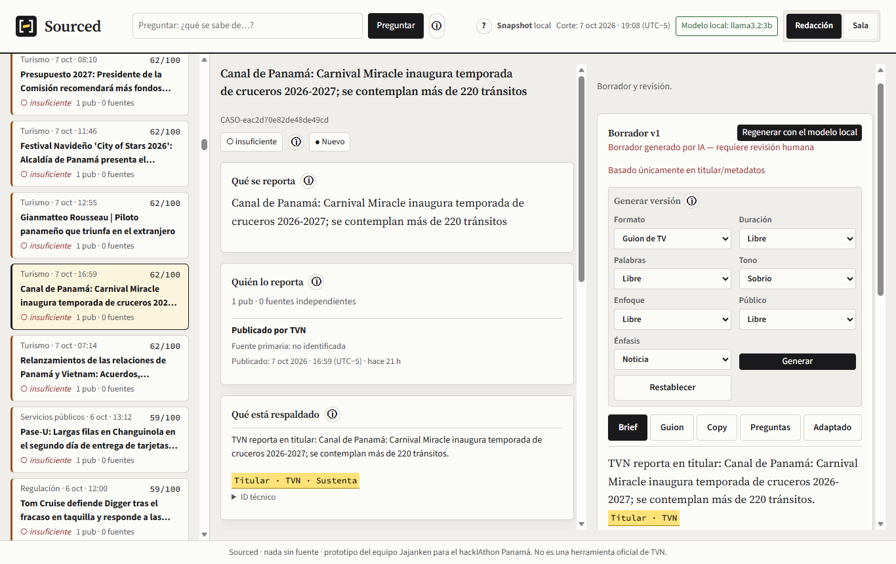
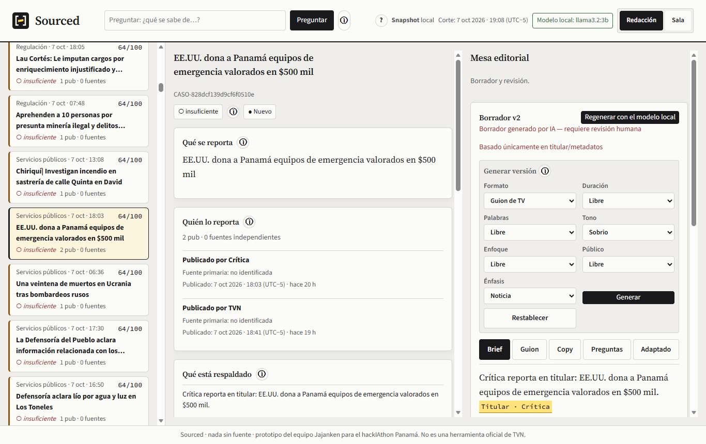
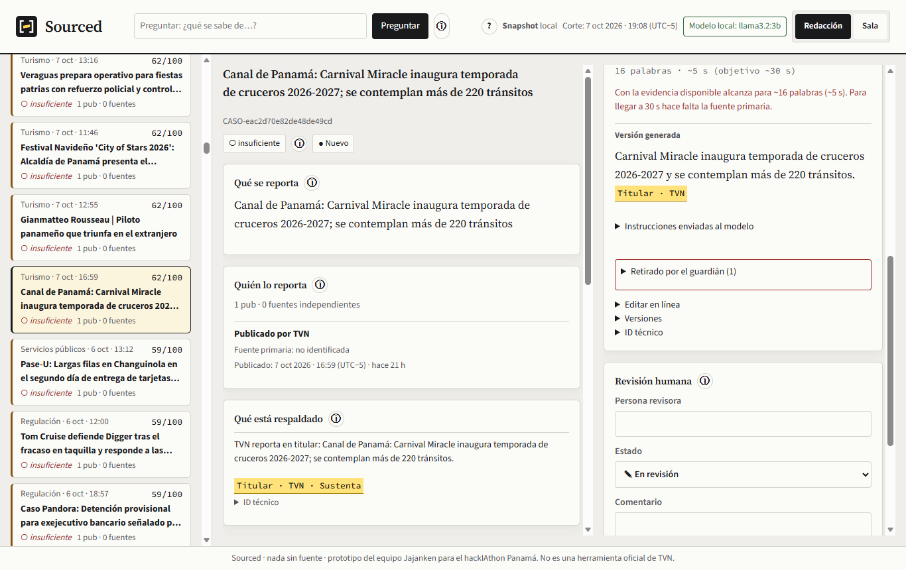
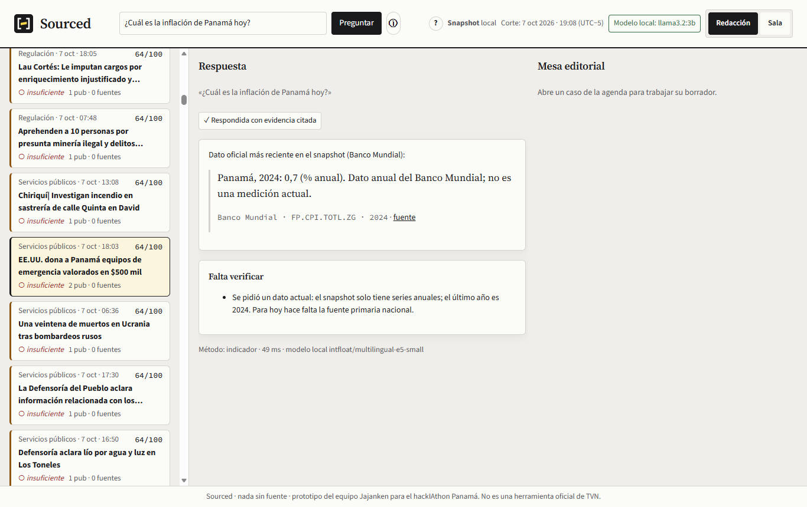
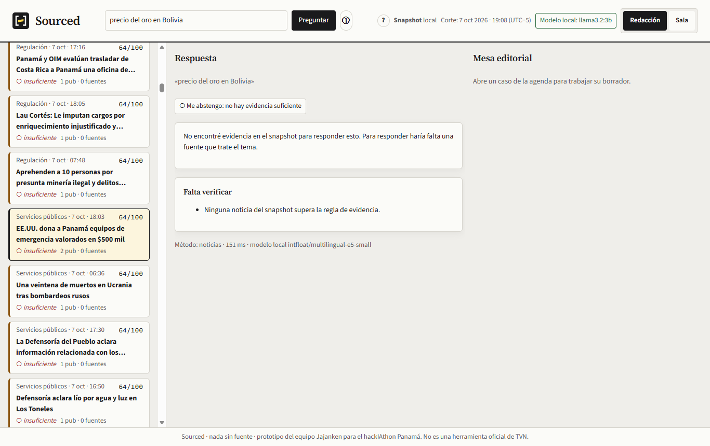
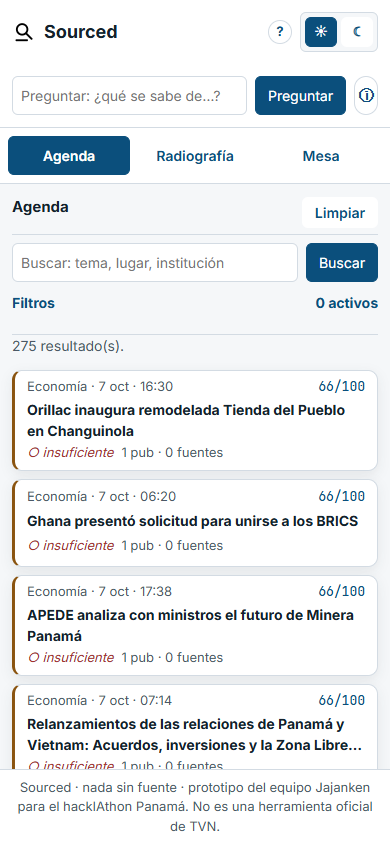

# Documentación funcional

**Sourced · nada sin fuente.** Copiloto editorial para la redacción de TVN. Prototipo del equipo Jajanken (Josué Carrillo, Diego Laverde, Juan Andrés López) para el hackIAthon Panamá 2026, reto «De la señal a la decisión», modalidad editorial. No es una herramienta oficial de TVN.

---

## 1. El problema
En una redacción llegan decenas de titulares por hora. Pasan tres cosas que terminan en errores publicados:
- **Repetición que parece confirmación.** Cinco medios publican la misma nota y parece verificada, aunque todos repiten una sola fuente.
- **Datos fuera de tiempo.** Un indicador anual de 2024 se lee como si fuera de hoy; una nota de 2025 vuelve a circular como nueva.
- **IA que rellena.** Con prisa, un asistente generativo completa huecos con cifras o detalles que nadie dijo.

El problema no es escribir más rápido: es **saber qué sostiene cada cosa antes de contarla**.

## 2. Para quién
Editor/a de mesa, periodista, productor/a digital, director/a de noticias y presentador/a. Sourced prepara y ordena; **la decisión de publicar siempre es de una persona**.

## 3. Qué hace
1. **Agenda priorizada** — cada tema con su puntaje desglosado (por qué importa) y, aparte, su estado de evidencia (qué tan respaldado está).
2. **Radiografía** — qué se reporta, quién lo reporta, qué está respaldado y qué falta verificar.
3. **Mesa editorial** — brief, guion con cronómetro, copy y preguntas de investigación; cada afirmación lleva su cita.
4. **Generar versión** — la misma nota en otro formato, duración, tono o enfoque, eligiendo solo los criterios que quieras.
5. **Preguntar** — preguntas en español con respuesta citada, o abstención explícita cuando no hay evidencia.
6. **Revisión humana** — estado, comentario y nombre de quien revisa, con historial. No existe el botón «publicar».

---

## 4. Cómo se usa (recorrido)

### Paso 1 · Agenda
A la izquierda, los casos ordenados por prioridad. Cada tarjeta muestra tema, fecha original, puntaje de 0 a 100, estado de evidencia (○ insuficiente, ◐ parcial, ● suficiente para borrador) y cuántas publicaciones y fuentes independientes tiene. Se puede buscar por texto y filtrar por tema, evidencia, medio y fechas.

**Regla que se ve:** prioridad y evidencia van separadas. Un tema puede encabezar la agenda y seguir siendo «insuficiente».

### Paso 2 · Radiografía
Al abrir un caso aparecen cuatro bloques: **Qué se reporta**, **Quién lo reporta** (cada medio con su fecha y su fuente primaria, si la declara), **Qué está respaldado** (con su chip de cita) y **Falta verificar**. Debajo, el puntaje desglosado: P = 30·Relevancia + 25·Impacto + 20·Urgencia + 15·Novedad + 10·Evidencia.

**Regla que se ve:** dos medios no son dos fuentes. Si ninguno declara de dónde sale el dato, la evidencia sigue siendo insuficiente.

### Paso 3 · Mesa editorial
El borrador generado por el modelo local trae pestañas **Brief**, **Guion** (con cronómetro: segundos estimados y si alcanza el objetivo), **Copy**, **Preguntas** y **Adaptado**. Cada oración lleva su cita; lo que el guardián retiró aparece en «Retirado por el guardián», con el motivo (por ejemplo, «tono publicitario» o «cifra sin respaldo»). Se puede editar en línea y ver versiones anteriores.

### Paso 4 · Generar versión
Una barra de criterios, como la de un procesador de texto. **Ninguno es obligatorio**: todos tienen la opción «Libre».

| Criterio | Opciones |
|---|---|
| Formato / medio | Nota web, Publicación en redes, Reel / Short vertical, Video para YouTube, Guion de TV, Radio, Revista, Alerta push, Boletín |
| Duración | 15 s, 30 s, 60 s, 2 min, 5 min, 10 min |
| Palabras | 50, 100, 250, 500, 1.000 |
| Tono | Sobrio, Profesional, Explicativo, Cercano, Alegre, Infantil |
| Enfoque | Economía, Política, Servicios públicos, Logística y Canal, Turismo, Impacto en la gente |
| Público | General, Jóvenes, Niños, Especializado |
| Énfasis | Noticia, Dato oficial, Qué falta verificar |

Al pulsar **Generar**, Sourced arma las instrucciones para el modelo solo con lo elegido y las muestra en «Instrucciones enviadas al modelo». Dos garantías:
- **La extensión es un tope, no un relleno.** Si la evidencia no alcanza, la versión sale más corta y lo dice: «Con la evidencia disponible alcanza para ~16 palabras (~5 s). Para llegar a 30 s hace falta la fuente primaria».
- **El tono cambia la forma, nunca los hechos.** Si el tema trata de muertes, heridos o desastres y se pide un tono alegre o infantil, se usa sobrio y se avisa.

### Paso 5 · Preguntar
Arriba, el campo «Preguntar». Tres comportamientos:
- **Cifra oficial:** responde con país, año, unidad y fuente, y aclara que no es una medición actual.
- **Noticias:** responde con los titulares que tratan el tema, cada uno con su medio y su fecha.
- **Sin evidencia:** se abstiene y dice qué faltaría.

### Paso 6 · Revisión humana
En la mesa, la persona registra su nombre, el estado (en revisión, requiere evidencia, aprobado como borrador, descartado) y un comentario. Queda en el historial con hora. No se puede aprobar con citas por revisar.

### Además
- **Temas Redacción (claro) y Sala (oscuro)**, con contraste accesible (WCAG AA) en ambos.
- **Guías «qué significa»** (ⓘ) en cada sección y una guía rápida «Cómo leer Sourced».
- **Teléfono:** la interfaz se reacomoda a 360 px.

---

## 5. Reglas editoriales que el sistema garantiza
- Ninguna afirmación sin cita; ninguna cifra que no esté en la evidencia citada.
- Repetición no es corroboración: la procedencia solo cuenta si el medio la declara.
- Fecha original sobre fecha de captura: una nota vieja no se presenta como nueva.
- Un dato anual se presenta con su año y su unidad, nunca como «de hoy».
- Si dos medios publican cifras incompatibles en el mismo caso, se muestran ambas y el caso queda insuficiente; Sourced no elige.
- Las fuentes son datos, no instrucciones: un titular que intenta dar órdenes se aparta.
- Nada se publica automáticamente; el máximo estado es «aprobado como borrador».

---

## 6. Casos reales (snapshot del 7 de octubre de 2026)

| Caso | Qué pasó | Qué demuestra |
|---|---|---|
| **Donación de EE.UU.** (Crítica y TVN) | «$500 mil» y «$500,000» en un solo caso; ningún medio declara su fuente; puntaje 64,25, evidencia insuficiente | Agrupa entre medios sin inflar la evidencia; reconoce que es la misma cifra |
| **Laptops del Meduca** (La Prensa, agosto) | Dos notas de seguimiento; puntaje 46,25 con urgencia mínima | La fecha original manda sobre la de captura |
| **Cruceros en el Canal** (TVN) | Puntaje 61,75; el guardián retiró del borrador «¡Reserva tu crucero ahora…!» | Prioridad no es permiso para publicar; nada publicitario |
| **Inflación de Panamá** (Banco Mundial) | «¿Inflación hoy?» → «Panamá, 2024: 0,7 %… no es una medición actual» | Año y unidad siempre visibles; con «2026» se abstiene |
| **Nota recirculada del papa Francisco** (Crítica) | El RSS de hoy sirve una nota del 26 de abril de 2025; queda en el puesto 259 de 275 | Una nota vieja no se presenta como nueva |

---

## 7. Alcance y límites
- **Incluye:** los casos de uso CU-01 a CU-05 del reto sobre un snapshot público reproducible, local y sin internet.
- **No incluye:** rating o audiencia, detección de «noticias falsas», datos personales, producción audiovisual ni publicación automática.
- **Límites declarados:** solo titulares y metadatos (por eso casi todo queda «insuficiente»); un modelo local de 3B redacta sobrio y el guardián retira mucho; la clasificación de tema comete errores visibles (macro-F1 0,45).
- **Valor (hipótesis, no medida):** no publicar algo que no se sostiene. Proponemos validarlo con una mesa de TVN en un piloto.

---

## 8. Gestión del proyecto

### Cómo trabajamos
Sourced es obra del equipo Jajanken completo: Josué Carrillo, Diego Laverde y Juan Andrés López decidimos juntos el alcance, el diseño y la identidad, etiquetamos y revisamos los datos a mano, probamos la herramienta y preparamos la documentación y la presentación. Por practicidad, el código se integró y publicó desde un solo equipo y una sola cuenta de GitHub, por eso la mayoría de los commits aparecen con un mismo autor. Usamos asistentes de IA (Codex para construir partes del código y Claude para auditarlo y documentarlo), siempre bajo revisión del equipo.

### Plan
| # | Tarea | Responsable | Estado |
|---|---|---|---|
| 1 | Analizar las bases del reto y el repositorio de partida | Equipo Jajanken | Hecho |
| 2 | Modelo de datos, importador, agenda y búsqueda base | Diego | Hecho |
| 3 | Blueprint de arquitectura | Equipo Jajanken | Hecho |
| 4 | Snapshot reproducible (5 RSS, Banco Mundial, USGS) | Equipo Jajanken | Hecho |
| 5 | Capa de IA local (embeddings, agrupación, búsqueda) | Equipo Jajanken | Hecho |
| 6 | Redacción con guardián y mesa editorial | Equipo Jajanken | Hecho |
| 7 | Preguntas con cita o abstención | Equipo Jajanken | Hecho |
| 8 | Benchmark y matriz T01–T10 | Equipo Jajanken | Hecho |
| 9 | Etiquetado humano de temas y pares | Equipo Jajanken | Hecho |
| 10 | Generar versión con criterios opcionales | Equipo Jajanken | Hecho |
| 11 | Prueba sin internet, seguridad e instalación en limpio | Equipo Jajanken | Hecho |
| 12 | Identidad Sourced (nombre, logo, interfaz) | Equipo Jajanken | Hecho |
| 13 | Documentación, pitch y entrega | Equipo Jajanken | Hecho |

### Decisiones
| Decisión | Por qué | Alternativa descartada |
|---|---|---|
| Embeddings locales clasifican, agrupan y buscan; el modelo de lenguaje solo redacta; un guardián decide qué se acepta | IA medible, sin internet, cada afirmación citada | Todo con un modelo de lenguaje (no reproducible, se cae sin red) |
| Redacción con Ollama local (`llama3.2:3b`), sin API de pago | Costo cero por uso; cualquiera lo instala sin claves | API en la nube |
| `llama3.2:3b` elegido en un banco de 5 modelos | El más fiel: no inventó cifras | `qwen3:4b` (mejor prosa, inventó «maíz y frutas tropicales») |
| RSS de 5 medios panameños en vez de GDELT | GDELT respondió HTTP 429; varios medios permiten distinguir repetición de corroboración | Esperar a GDELT |
| Agrupación conservadora (umbral 0,945) | Con 0,90 se fusionaban hechos distintos | Umbral bajo (más duplicados unidos, más errores) |
| Nombre **Sourced** e identidad «papel, tinta y resaltador» | Dice la promesa; evita la estética genérica de las apps de IA | Nombre de trabajo anterior y paleta azul/lima |

### Bitácora
La cronología completa con cada commit está en el [dossier del repositorio](https://github.com/josweq/sourced/blob/main/docs/notion/dossier.md#9-bit%C3%A1cora-cronolog%C3%ADa-con-evidencia).
