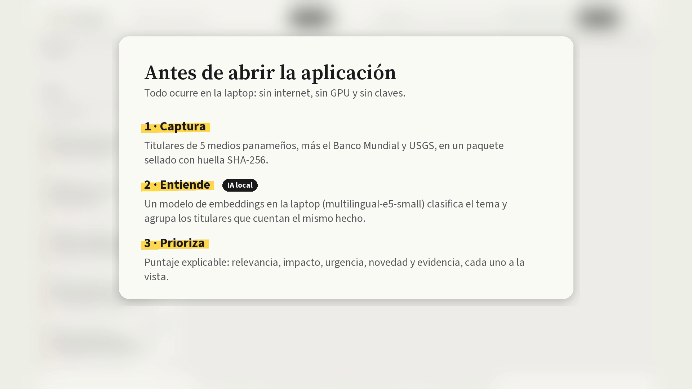
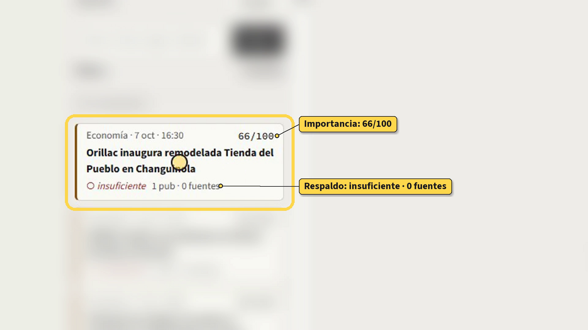
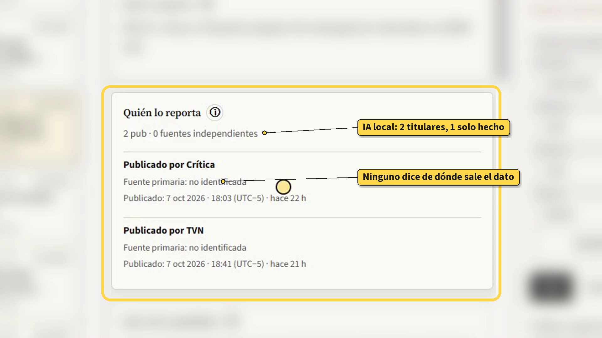
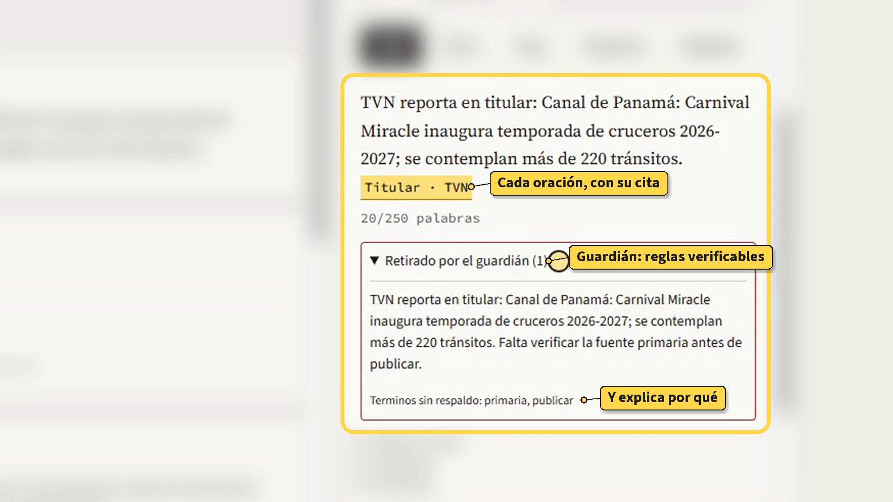
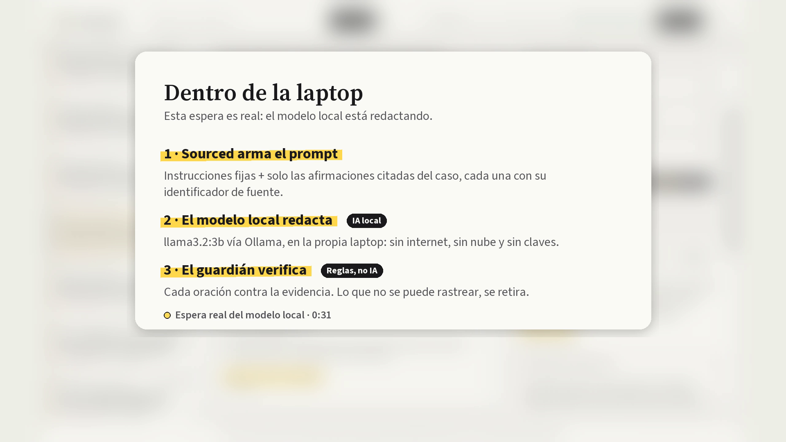
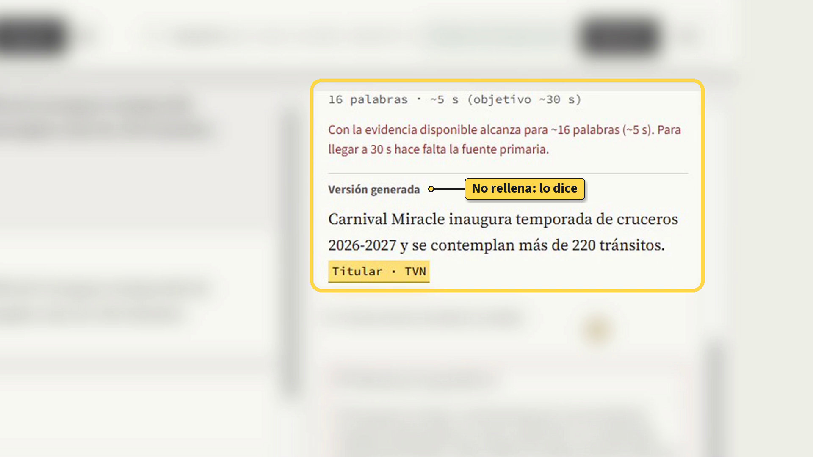
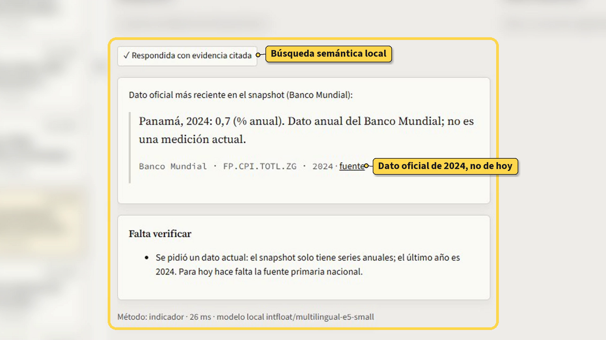
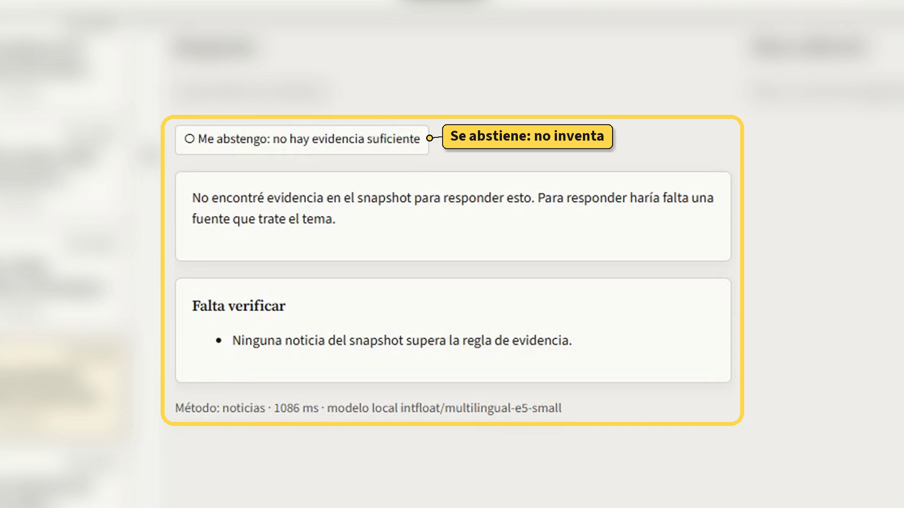
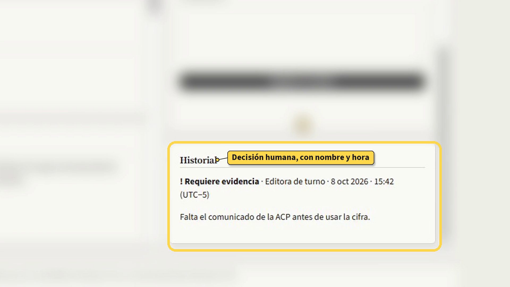

# Presentación · Pitch Day

## Nada sin fuente.
Copiloto editorial para la redacción de TVN · Equipo **Jajanken** (Josué Carrillo · Diego Laverde · Juan Andrés López) · hackIAthon Panamá 2026 · Reto «De la señal a la decisión»

**Video de demostración (4:43):** la aplicación real, con datos reales, de principio a fin, con la inteligencia artificial de cada etapa explicada.

---

# 1 · El problema

> **Que una noticia circule no significa que esté confirmada.**

- Cinco medios repiten la misma nota y **parece** verificada.
- Un dato de 2024 se lee como si fuera **de hoy**.
- Con prisa, una IA generativa **rellena** con cifras que nadie dijo.

---

# 2 · Qué es Sourced

> Un copiloto editorial que separa siempre dos preguntas: **¿qué tan importante es?** y **¿qué tan respaldado está?**

- Ordena la agenda del día y explica el porqué de cada tema.
- Redacta borradores donde **cada oración lleva su cita**.
- Cuando no hay evidencia, **lo dice**.
- Corre en una laptop: **sin internet, sin GPU, sin claves, costo cero por uso**.

---

# 3 · Cómo funciona por dentro

1. **Captura** — titulares de 5 medios panameños (TVN, La Prensa, Crítica, Panamá América, En Segundos), indicadores del Banco Mundial y sismos de USGS, en un paquete con huella SHA-256.
2. **Valida** — filas inválidas a cuarentena; los nulos nunca se vuelven cero.
3. **Entiende** — un modelo local de embeddings clasifica el tema y agrupa los titulares que cuentan el mismo hecho.
4. **Prioriza** — puntaje explicable: relevancia, impacto, urgencia, novedad y evidencia, cada uno visible.
5. **Redacta** — un modelo local escribe solo con las afirmaciones citadas.
6. **Vigila** — un guardián revisa cada oración: sin cita, sin cifra inventada, sin tono publicitario, sin instrucciones escondidas.
7. **Decide una persona** — revisión con nombre y hora; nada se publica solo.

---

# 4 · Paso 1 — La agenda

> Los temas del día ordenados por prioridad. Cada tarjeta muestra, **por separado**, cuánto importa y qué tan respaldado está.

---

# 5 · Paso 2 — La radiografía

> Qué se reporta, quién lo reporta, qué está respaldado y qué falta verificar.

Crítica y TVN publican la misma donación de EE.UU.: Sourced las une en **un caso**, y la evidencia sigue **insuficiente** porque ninguno declara de dónde sale el dato. **Dos medios no son dos fuentes.**

---

# 6 · Paso 3 — La mesa editorial

> Brief, guion con cronómetro, copy y preguntas de investigación. Cada oración con su cita; lo que el guardián retira aparece con su motivo.

---

# 7 · Paso 4 — Generar versión

> La misma nota en otro formato, eligiendo solo los criterios que quieras: formato, duración, palabras, tono, enfoque o público.

**No rellena:** si la evidencia no alcanza para el objetivo, lo dice — «alcanza para ~16 palabras; para llegar a 30 s hace falta la fuente primaria». Las instrucciones que recibió el modelo quedan a la vista.

**Dentro de la laptop:** Sourced arma el prompt con instrucciones fijas y solo las afirmaciones citadas; el modelo local (llama3.2:3b) redacta sin internet; el guardián vuelve a revisar cada oración.

---

# 8 · Paso 5 — Preguntar

| «¿Cuál es la inflación de Panamá hoy?» | «Precio del oro en Bolivia» |
|---|---|
| Panamá, 2024: 0,7 %. Dato anual del Banco Mundial; **no es una medición actual**. | **Me abstengo:** no hay evidencia en los datos. |

---

# 9 · Paso 6 — Decide una persona

> Quien revisa deja su nombre, el estado y un comentario. Todo queda en el historial. **No existe el botón «publicar»:** lo máximo es «aprobado como borrador».

---

# 10 · Medido, no prometido

| Qué medimos | Resultado |
|---|---|
| Preguntas respondidas bien (40) | **37/40** · búsqueda simple sin IA: 35/40 |
| Se abstiene cuando no hay respuesta | **7/7** · búsqueda simple: 4/7 |
| Clasificación de tema (284 etiquetas revisadas por el equipo) | macro-F1 **0,45** · reglas: 0,26 |
| Pruebas de aceptación del reto (T01–T10) | **10/10** |
| Sin internet, con el Wi-Fi cortado | **0 de 52** intentos salieron a la red |
| Seguridad (OWASP / CWE) | **0** hallazgos críticos o altos |
| Pruebas automáticas | **125** |

---

# 11 · Lo que viene (planeado)

- **Cuerpo de la nota autorizado** — hoy solo usa titulares; con el texto completo, la evidencia de cada caso puede subir de «insuficiente» a «suficiente para borrador».
- **Fuente primaria integrada** — comunicados oficiales (Gaceta Oficial, ACP, ministerios) y datos nacionales (INEC, Contraloría) para confirmar, no solo repetir.
- **Contradicciones en el texto completo** — hoy compara cifras entre titulares; después, entre notas completas.
- **Video y audio de TVN como evidencia** — transcripción local de piezas de televisión y radio, con la cita al minuto exacto.
- **Modelo local más capaz** — mejor prosa sin perder el control del guardián.
- **Más etiquetas de la redacción** — para afinar la clasificación de temas con el criterio de TVN.

---

# 12 · Integraciones futuras

| Integración | Qué haría | Regla que no cambia |
|---|---|---|
| **Redes sociales** (X, Instagram, TikTok, Facebook) | Publicar la versión aprobada directamente, con su formato (reel, post, hilo) | Solo después de aprobación humana; cada publicación queda registrada con su cita |
| **CMS de la web de TVN** | Enviar la nota aprobada como borrador al gestor de contenidos | Nunca se publica sin un editor |
| **Sistema de guiones del noticiero** | Llevar el guion cronometrado al rundown y al teleprompter | La cita viaja con el guion |
| **Agencias y cables** (EFE, AP, Reuters) | Más señales de entrada, con procedencia declarada | Repetición no es corroboración |
| **Monitoreo de redes de instituciones** | Detectar anuncios oficiales en cuentas verificadas | Una publicación no confirma un hecho por sí sola |
| **Alertas al equipo** (Teams, Slack, WhatsApp) | Avisar cuando un tema sube en la agenda o aparece una contradicción | La alerta lleva su evidencia |
| **Procedencia de imágenes** (C2PA) | Verificar el origen de fotos y videos | Sin procedencia, se marca como no verificada |

---

# Antes de contar una historia, mostramos qué la sostiene.

**Sourced · nada sin fuente.**

- Repositorio público: https://github.com/josweq/sourced
- Documentación técnica y funcional: en la página del equipo, en este mismo espacio.

Equipo Jajanken: Josué Carrillo · Diego Laverde · Juan Andrés López
